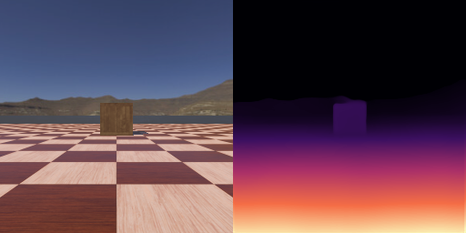
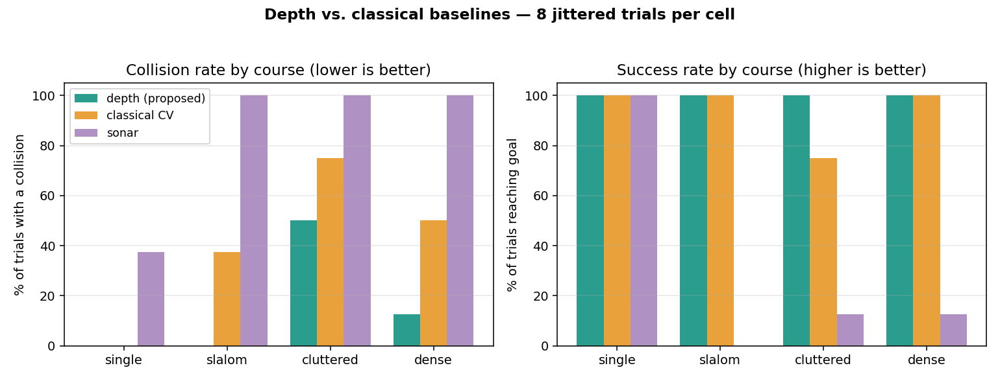

# Monocular-Depth Obstacle Avoidance in Webots

A wheeled robot (Pioneer 3-AT) that navigates and avoids obstacles using
**real-time monocular depth estimation** (MiDaS-Small via `torch.hub`) from a
single forward camera — benchmarked quantitatively against two **classical
baselines** (appearance-based CV and sonar proximity) in the same simulated
world, across obstacle courses of increasing difficulty.

> Across 96 trials (4 courses × 8 reps × 3 controllers), depth-based avoidance
> reaches the goal 100% of the time and cuts the collision rate **62%** vs the
> classical-CV baseline (full table and chart below).



*The robot's camera (left) and the live MiDaS-Small depth map (right): the
obstacle stands out as "nearer than the floor," which is what drives the
avoidance. A demo GIF of a full run can be generated with
[`scripts/record_demo.sh`](scripts/record_demo.sh).*

---

## Why this project

Classical obstacle avoidance leans on hand-tuned cues — edges, range sensors,
floor-appearance models. This project asks: *can a learned monocular depth model
drive an avoidance policy, and how does it compare — quantitatively — to the
classical approaches?*

The experiment is designed to isolate **perception**. All three controllers run
on the **same robot, same actuators, same speed limits, same steering/goal-seek
controller, and same logging** — the *only* thing that differs is how each turns
its sensor data into a left/center/right "blockage" estimate:

| Controller | Perception | Sensor |
|---|---|---|
| `depth_nav` (proposed) | MiDaS-Small monocular depth | forward camera |
| `classical_cv_nav` | appearance-based free-space (Ulrich & Nourbakhsh) | forward camera |
| `sonar_nav` | 16-sonar ring, front zones | sonar |

## Hardware / platform

Developed on macOS (Apple Silicon **M4**). PyTorch uses the **MPS (Metal)**
backend for GPU-accelerated inference (~18 ms/frame for MiDaS-Small at 256×256);
the same code falls back to CUDA on NVIDIA machines and to CPU otherwise — all
comfortably real-time for the 32 ms control loop.

## Repository layout

```
DepthEstimator/
├── protos/
│   └── NavRobot.proto         # Pioneer 3-AT + camera + GPS + display + collision bumper
├── worlds/
│   └── course_*.wbt           # generated course layouts (single/slalom/cluttered/dense)
├── controllers/
│   ├── lib/                   # ONE source of truth, shared by all controllers
│   │   ├── robot_io.py        #   hardware abstraction (wheels, camera, sonar, GPS, bumper)
│   │   ├── depth_model.py     #   MiDaS-Small wrapper (device auto-select, colorize)
│   │   ├── policies.py        #   the 3 perception front-ends -> L/C/R blockage
│   │   ├── avoidance.py       #   Navigator: avoidance + goal-seeking + hysteresis
│   │   ├── episode.py         #   shared control loop + termination
│   │   ├── metrics.py         #   per-run logging (outcome/time/distance/collisions)
│   │   └── controller_main.py #   env-driven entry point + calibration mode
│   ├── depth_nav/             # thin wrapper -> DepthPolicy
│   ├── classical_cv_nav/      # thin wrapper -> ClassicalCVPolicy
│   └── sonar_nav/             # thin wrapper -> SonarPolicy
├── eval/
│   ├── courses.py             # course specs (obstacle layouts, difficulty)
│   ├── make_world.py          # generates .wbt worlds (+ seeded jitter per trial)
│   ├── run_eval.py            # batch harness: runs all controllers × courses × reps
│   ├── plot_results.py        # renders docs/results_chart.png
│   └── results/               # results.jsonl + results_table.md
├── scripts/
│   └── record_demo.sh         # capture a run -> demo GIF
├── docs/                      # images (depth example, results chart, demo)
├── requirements.txt
└── README.md
```

## Setup

1. **Webots** R2025a (tested). Install to the default location.
2. **Python env** (conda recommended):
   ```bash
   conda create -y -n depthnav python=3.10
   conda activate depthnav
   pip install -r requirements.txt
   ```
3. **Wire Webots to this env.** Each controller has a `runtime.ini` with a
   `[python] COMMAND = ...` line pointing at the env's `python`. Edit that path
   to match your machine (`conda run -n depthnav which python`). The Webots
   `controller` module ships with Webots and is injected at runtime.

## Running

Open any `worlds/course_*.wbt` in Webots and press play (the depth panel renders
next to the camera), or run headless:

```bash
export WEBOTS_HOME=/Applications/Webots.app/Contents          # macOS
webots --mode=fast --stdout --stderr worlds/course_slalom.wbt
```

Swap which approach drives by editing the world's `NavRobot.controller` field
(`depth_nav` / `classical_cv_nav` / `sonar_nav`).

### Reproduce the evaluation

```bash
python eval/run_eval.py --reps 8         # all courses × all controllers (writes results.jsonl + table)
python eval/run_eval.py --summarize-only # re-print the table from saved results
python eval/plot_results.py              # regenerate docs/results_chart.png
```

### Capture a demo

```bash
brew install ffmpeg                          # one-time, for the GIF step
scripts/record_demo.sh slalom depth_nav      # records the run -> docs/demo.gif
```

This runs the chosen course with rendering on, records the 3D view to mp4 via the
controller's Supervisor hook (`NAV_RECORD`), and converts it to a GIF.

## Results

**96 trials** — 3 controllers × 4 courses × 8 seeded-jitter repetitions.

**Overall** (all courses pooled, 32 runs per controller):

| Controller | Success | Collision rate | Mean collisions/run |
|---|---:|---:|---:|
| **depth (proposed)** | **100%** | **16%** | **0.25** |
| classical_cv | 94% | 41% | 1.34 |
| sonar | 31% | 84% | 2.19 |

→ Depth-based avoidance **cuts the collision rate by 62%** (41% → 16%) and per-run
collisions by **81%** (1.34 → 0.25) versus the classical-CV baseline, while raising
goal-reaching success from 94% to **100%**.



**By course** (increasing difficulty):

| Course (difficulty) | Controller | Trials | Success | Collision rate | Mean collisions | Mean time (s) | Mean dist (m) |
|---|---|---:|---:|---:|---:|---:|---:|
| single (1) | depth | 8 | 100% | 0% | 0.00 | 45.6 | 11.8 |
| single (1) | classical_cv | 8 | 100% | 0% | 0.00 | 41.4 | 10.8 |
| single (1) | sonar | 8 | 100% | 38% | 0.38 | 37.2 | 9.8 |
| slalom (2) | depth | 8 | 100% | 0% | 0.00 | 48.9 | 12.6 |
| slalom (2) | classical_cv | 8 | 100% | 38% | 1.25 | 51.6 | 12.8 |
| slalom (2) | sonar | 8 | 0% | 100% | 3.88 | 29.5 | 6.1 |
| cluttered (3) | depth | 8 | 100% | 50% | 0.75 | 52.9 | 13.5 |
| cluttered (3) | classical_cv | 8 | 75% | 75% | 1.62 | 55.8 | 13.4 |
| cluttered (3) | sonar | 8 | 12% | 100% | 2.12 | 58.2 | 14.6 |
| dense (4) | depth | 8 | 100% | 12% | 0.25 | 52.1 | 13.4 |
| dense (4) | classical_cv | 8 | 100% | 50% | 2.50 | 62.7 | 15.8 |
| dense (4) | sonar | 8 | 12% | 100% | 2.38 | 49.1 | 11.8 |

**Reading the table:** depth stays collision-light and reaches the goal in 100% of
trials as clutter increases; classical CV degrades steadily (more collisions, and
it starts failing on the cluttered course); the narrow-beam sonar baseline can't
reliably handle laterally-offset obstacles and mostly fails the harder courses —
included as a lower-bound reference rather than a competitive method.

**Metrics** (per run): *outcome* (reached / timeout / stuck), *completion time*,
*distance travelled*, and *collisions* (distinct contact events from the bumper).
*Collision rate* = fraction of trials with ≥1 collision; *success rate* =
fraction reaching the goal within the time budget.

## Method notes

- **Depth model:** MiDaS-Small (`intel-isl/MiDaS`, `MiDaS_small`) via `torch.hub`,
  256×256 input. Output is *relative inverse depth* (larger = nearer), used for
  comparative zone reasoning, not metric distance.
- **Depth avoidance:** the depth map's per-row median (the floor/background
  baseline at each image height) is subtracted to isolate *obstacles nearer than
  the floor* — this neutralizes MiDaS's strong vertical floor gradient and its
  arbitrary per-frame scale. The residual is split into left/center/right zones.
- **Classical CV baseline:** appearance-based free-space detection — a
  Hue-Saturation histogram of the floor (sampled in front of the robot, smoothed
  over time) is back-projected to flag non-floor pixels; morphological opening +
  a per-frame free-space subtraction clean the signal. A naïve Canny/edge-density
  score was tried first and saturated on textured floors — a documented weakness
  of edge-only methods, kept only for the visualization.
- **Sonar baseline:** the front sonar zones' nearest-return distance, mapped to a
  blockage score (same idea as a classic Braitenberg/potential-field controller).
- **Shared steering:** all blockage estimates feed one `Navigator` that steers
  toward the more-open side, blended with GPS-heading goal-seeking, with
  **directional hysteresis** (commit to a side and hold a lateral offset until the
  obstacle is passed) so narrow/noisy detectors don't oscillate into obstacles.
- **Calibration:** each perception's reaction thresholds were set from a
  straight-approach run that logs blockage vs. **ground-truth distance**
  (`NAV_CALIBRATE=1`), not hand-guessed.
- **Fair multi-trial evaluation:** the simulator is deterministic, so each trial
  applies small **seeded jitter** to obstacle positions and the robot's start
  pose. The seed depends only on `(course, rep)`, so in a given rep all three
  controllers face the *identical* layout, while different reps are genuinely
  different — making collision/success *rates* meaningful.
